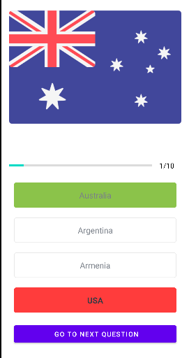

## Guess The Flag Quiz App-Kotlin 

This app has. 

1. Navigation Component
2. DataBinding
3. Fragments
4. For loop. 
5. ArrayList
6. Kotlin Object. 

### Title Fragement

### Game Fragment

### Score Fragment

